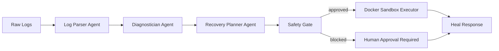

# Multi-Agent Self Healer

LLM reasoning agents that parse unstructured Linux kernel and systemd log failures, diagnose root causes, and execute targeted Bash recovery sequences — with deterministic safety constraints and Docker-sandboxed execution to limit blast radius.

## Architecture



### Agents

| Agent | Role | LLM? |
|-------|------|------|
| **Log Parser** | Extracts events, error signatures, severity from messy kernel/systemd logs | Yes (or heuristic fallback) |
| **Diagnostician** | Determines root cause and failure category (OOM, disk full, deadlock, etc.) | Yes (or heuristic fallback) |
| **Recovery Planner** | Produces minimal Bash recovery steps with risk ratings | Yes (or heuristic fallback) |
| **Safety Gate** | Deterministic allowlist/blocklist validation — no LLM | No |

### Blast Radius Mitigation

1. **Prompt constraints** — All LLM agents share a strict safety preamble: JSON-only output, no destructive commands, single-statement commands only.
2. **Command allowlist** — Recovery commands must match permitted prefixes (`systemctl`, `journalctl`, `df`, log truncation in `/var/log`, etc.).
3. **Blocklist** — `rm -rf /`, `dd`, pipes to shell, privilege escalation, firewall flush, and compound commands are rejected.
4. **Docker sandbox** — Approved commands run in an isolated container with:
   - No network
   - Read-only root filesystem
   - Dropped capabilities
   - Memory/CPU limits
   - `no-new-privileges`
5. **Human-in-the-loop** — High-risk steps and low-confidence plans require explicit approval (`auto_execute=false` by default).

## Quick Start

### Prerequisites

- Python 3.11+
- Docker (for sandboxed execution)

### Install

```bash
cd "Multi Agent Self Healer"
python -m venv .venv
source .venv/bin/activate
pip install -e ".[dev]"
cp .env.example .env
# Edit .env with your OPENAI_API_KEY (optional — heuristics work without it)
```

### Build sandbox image

```bash
docker build -f docker/sandbox.Dockerfile -t self-healer-sandbox:latest .
```

### Run the service

```bash
self-healer
# or: uvicorn self_healer.main:app --host 0.0.0.0 --port 8080
```

### Analyze logs (no execution)

```bash
curl -s -X POST http://localhost:8080/analyze \
  -H "Content-Type: application/json" \
  -d "{\"logs\": $(jq -Rs . fixtures/sample_logs/oom_kernel.log)}"
```

### Full heal with sandbox execution

```bash
curl -s -X POST http://localhost:8080/heal \
  -H "Content-Type: application/json" \
  -d "{\"logs\": $(jq -Rs . fixtures/sample_logs/systemd_deadlock.log), \"auto_execute\": true}"
```

### Docker Compose

```bash
export OPENAI_API_KEY=sk-...
docker compose up --build
```

## API

| Endpoint | Method | Description |
|----------|--------|-------------|
| `/health` | GET | Service health and config status |
| `/analyze` | POST | Parse → diagnose → plan (never executes) |
| `/heal` | POST | Full pipeline; executes if `auto_execute=true` and safety approves |

### Request body

```json
{
  "logs": "raw kernel/systemd log text",
  "source_hint": "kernel|systemd|mixed|unknown",
  "auto_execute": false,
  "context": {}
}
```

## Configuration

| Variable | Default | Description |
|----------|---------|-------------|
| `OPENAI_API_KEY` | — | Enables LLM agents (heuristics used if unset) |
| `OPENAI_MODEL` | `gpt-4o-mini` | Model for all agents |
| `SELF_HEALER_AUTO_EXECUTE` | `false` | Global execution toggle |
| `SELF_HEALER_MAX_RECOVERY_STEPS` | `5` | Max steps per plan |
| `SELF_HEALER_SANDBOX_IMAGE` | `self-healer-sandbox:latest` | Sandbox container image |

## Tests

```bash
pytest
```

## Testing without production servers

You don't need real infrastructure or model training. See **[docs/TESTING.md](docs/TESTING.md)** for:

- **LogHub** — real Linux logs for parser/diagnostician benchmarking
- **Local failure lab** — Docker + systemd environment that injects OOM, disk-full, and service failures
- **Offline fixtures** — works with zero API key

Quick start:

```bash
bash scripts/demo_stack.sh run crash        # Node.js demo (recommended)
bash scripts/fetch_loghub_sample.sh
python scripts/benchmark_logs.py
```

## Design Goals

- **40% autonomous resolution target** — Heuristic + LLM pipeline targets common deadlocks: OOM cascades, disk-full journal failures, systemd start-limit loops, and dependency ordering deadlocks.
- **Deterministic safety** — The Safety Gate is purely rule-based; LLM output is never trusted without allowlist validation.
- **Sandbox-first** — Even approved commands never touch the host; they run in an isolated Docker environment.

## Project Structure

```
src/self_healer/
├── agents/          # LLM reasoning agents
├── safety/          # Prompt constraints + command allowlist
├── executor/        # Docker sandbox runner
├── orchestrator/    # Multi-agent pipeline
├── heuristics.py    # Deterministic fallback (no API key needed)
└── main.py          # FastAPI service
```

## License

MIT
