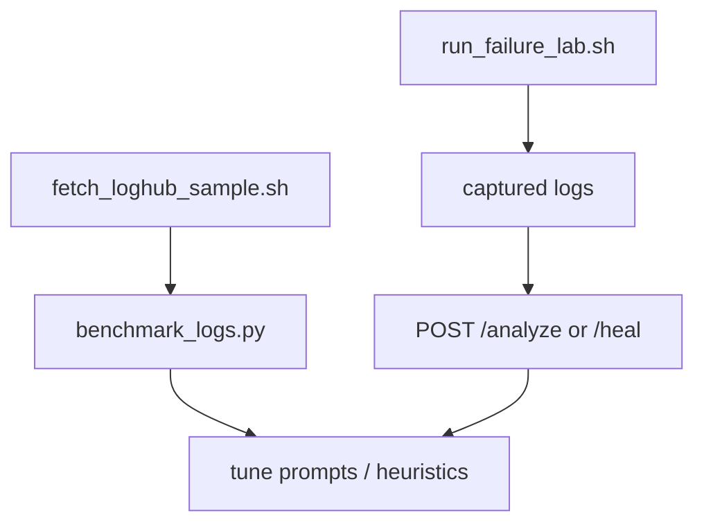

# Testing & evaluation (no production servers required)

You do **not** need to train a model from scratch. This project uses:

1. **Public log datasets** — benchmark parse + diagnose accuracy
2. **Local Docker failure lab** — generate real journald/kernel logs and test recovery
3. **Heuristic mode** — works with zero API key for offline dev

## Option A: LogHub (parse/diagnose benchmarking)

[LogHub](https://github.com/logpai/loghub) provides **real Linux `/var/log/messages` data** collected over 260+ days. Free for research.

```bash
bash scripts/fetch_loghub_sample.sh
python scripts/benchmark_logs.py          # heuristic mode
python scripts/benchmark_logs.py --llm    # with OPENAI_API_KEY set
```

Also useful from LogHub: **OpenSSH**, **Apache**, **HDFS** logs if you expand beyond kernel/systemd.

| Dataset | Use for | Size |
|---------|---------|------|
| [LogHub Linux](https://github.com/logpai/loghub/tree/master/Linux) | Parser + diagnostician eval | 2k sample / full 25k lines |
| [LogHub OpenSSH](https://github.com/logpai/loghub/tree/master/OpenSSH) | Auth/service failure patterns | Large |
| [LogHub-2.0](https://github.com/logpai/loghub-2.0) | Annotated templates (research) | Zenodo download |

## Option B: Node.js demo stack (recommended hands-on lab)

A **real Node.js API + Redis** stack in Docker. Break it manually, capture logs, run self-healer.

```bash
bash scripts/demo_stack.sh up
bash scripts/demo_stack.sh break crash      # or: oom | redis_down | flood
bash scripts/demo_stack.sh capture crash
bash scripts/demo_stack.sh heal             # needs self-healer running on :8080

# All-in-one
bash scripts/demo_stack.sh run crash
```

See **[demo/README.md](../demo/README.md)** for manual `curl` break commands.

Scenarios:

| Scenario | What happens |
|----------|----------------|
| `crash` | Node process exits → Docker restart loop |
| `oom` | Memory leak → container OOM kill (256MB limit) |
| `redis_down` | Stop Redis → API health fails, dependency errors |
| `flood` | Thousands of error log lines |

## Option C: systemd failure lab (kernel/journald style)

A **Docker + systemd lab** that injects real failures and exports logs you feed into `/heal`:

```bash
# All-in-one: build lab, inject failure, capture logs
bash scripts/run_failure_lab.sh run service_failure
bash scripts/run_failure_lab.sh run disk_full
bash scripts/run_failure_lab.sh run oom

# Then analyze captured logs
curl -s -X POST http://localhost:8080/analyze \
  -H "Content-Type: application/json" \
  -d "{\"logs\": $(jq -Rs . fixtures/lab_captured/*.log | head -1)}"
```

Scenarios:

| Scenario | What it simulates |
|----------|-------------------|
| `service_failure` | systemd unit stop / crash |
| `disk_full` | No space left on device |
| `oom` | Memory exhaustion (512MB container limit) |

> **Note:** The lab container runs `--privileged` for systemd. It is isolated from your host — only use this lab image, not production hosts.

## Option D: Existing fixtures (offline, zero setup)

```bash
pytest                                    # safety + heuristic tests
python scripts/benchmark_logs.py          # uses fixtures/sample_logs/*.log
```

## What you are NOT required to have

| Myth | Reality |
|------|---------|
| Production servers | Docker lab + LogHub samples are enough |
| Fine-tuning GPUs | Prompt engineering + evaluation on LogHub |
| Real outages | Scripts inject failures on demand |

## Suggested workflow



1. **Week 1:** LogHub benchmarks → tune parser/diagnostician prompts
2. **Week 2:** Failure lab → validate recovery plans in sandbox
3. **Week 3:** Track resolution rate on lab scenarios (target: 40% autonomous)
